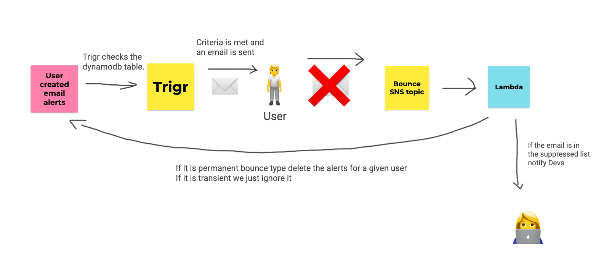

# Housekeeper

The Ophan Dashboard lets you [configure email alerts](https://dashboard.ophan.co.uk/alerts),
which are later sent by Trigr when traffic passes the configured threshold.
When Ophan's Trigr sends those emails, some of them are bounced, either because the email has
an out of office automatic reply, or because the email no longer exists.

If too many emails bounce, Amazon will put us on 'probation' (this has happened
[before](https://github.com/guardian/ophan/issues/2765)), and then place us on a deny list, 
preventing us from sending emails altogether.

The Ophan Housekeeper is an AWS Lambda that receives these bounce emails, and for each 
hard bounce (email no longer exists) it clears all subscriptions for that email
in our DynamoDB table that keep tracks of email alerts users have set up.

### Original Code

This code was copied over from the main Ophan repository, you can see the last version of it
there at:

https://github.com/guardian/ophan/tree/last-version-of-housekeeper-in-main-ophan-repo/housekeeper

### How to test locally?
- Run Janus credentials in your terminal.
- Go to (PROD) Ophan dashboard and create an email alert which you will find under `More -> Email Alerts`. Now you should have 1 email alert before the form.
- Make a copy of `permanentBounce.ophanAlert.json` which you will find it under `src/test/resources` and store it somewhere that you can grab it later in the terminal.
- Change the email address in duplicate file which you will find in `bounce` object (probably the `guardian.co.uk` variant - not the `theguardian.com` variant).
- Run `sbt` in the terminal or go to the sbt console and then type this command `run <your file path>` and the easiest way to do this is to drag the file in te terminal and that will give you the path.
- Now if you go back to Ophan dashboard Email Alerts page and refresh you should see no alerts.
